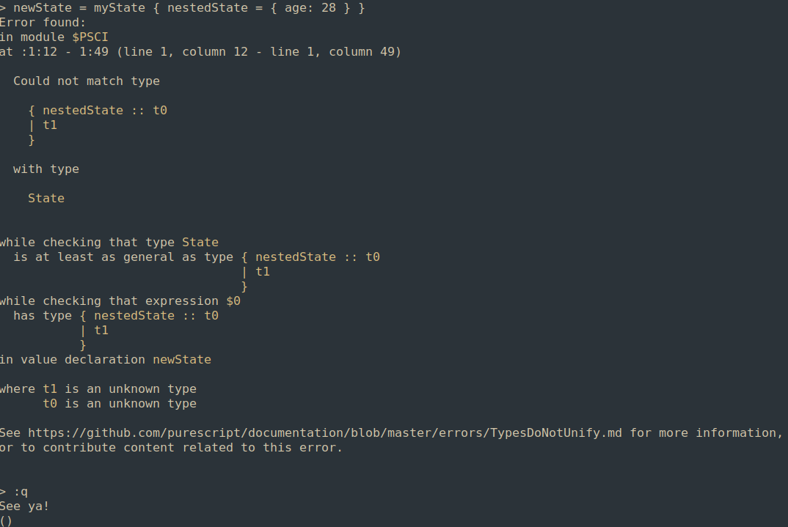
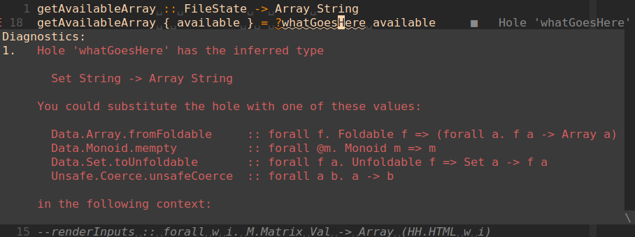

# Gotchas

I added a package to my project with `spago install matrices`, but in the editor when I wrote `import Matrix as M`, the LSP was giving me an error about the package not being found
In the package.json of the project, I had this line: `  "watch": "spago build --watch --then \"npm run bundle\"",` that I was using to run spago in watch mode. The issue was that spago must not have told the compiler about the new package that was added while it was running. I had to restart the `watch` command to get the project to compile.

## Record Update Syntax
```
data State = State { nestedState :: { name :: String, age :: Int }
}
```
would make it difficult to use record update syntax. Writing something like
```
initialState = State { nestedState: { name="Matt", age=28 } }
let derivedState = initialState { nestedState { age=29 } }
```
would cause a type error like



I think it's better to use `type` in purescript to describe records
[terminal log example](./records.txt)

## Arrays vs Lists
`[]` declares an array that is compatible with a Javascript array in Purescript, not a List
It kinda looks like you use Arrays more than Lists in purescript, since the handy syntax `[]` is reserved for arrays. Importing Data.List gives you Haskell-like lists, but maybe they're not used as much as they are in Haskell.

## Complaining About Syntax
I didn't like this `forall` bit: `renderInputs :: forall w i. M.Matrix String -> Array (HH.HTML w i)`. I assumed that you could leave it out, but it doesn't look like that's the case.
I assume this gives us some sort of power later where we can use terms other than `forall`, or specify further constraints or something. Whether it's just boilerplate or not remains to be seen

## Going from a Set to an Array
I didn't know how to do it, and googling it didn't help until I found a stacked overflow post that showed how to use type holes. Does Haskell have this? This is sweet:

Oh yeah, the conclusion was Data.Array.fromFoldable

## Getting a value from a select element
I wanted to use `onChange` at first but that didn't work because it gave me some weird event type that I didn't know how to use (ev.target.value didn't work). You're supposed to use the onValueChange handler, because it just gives you the string of what was selected
